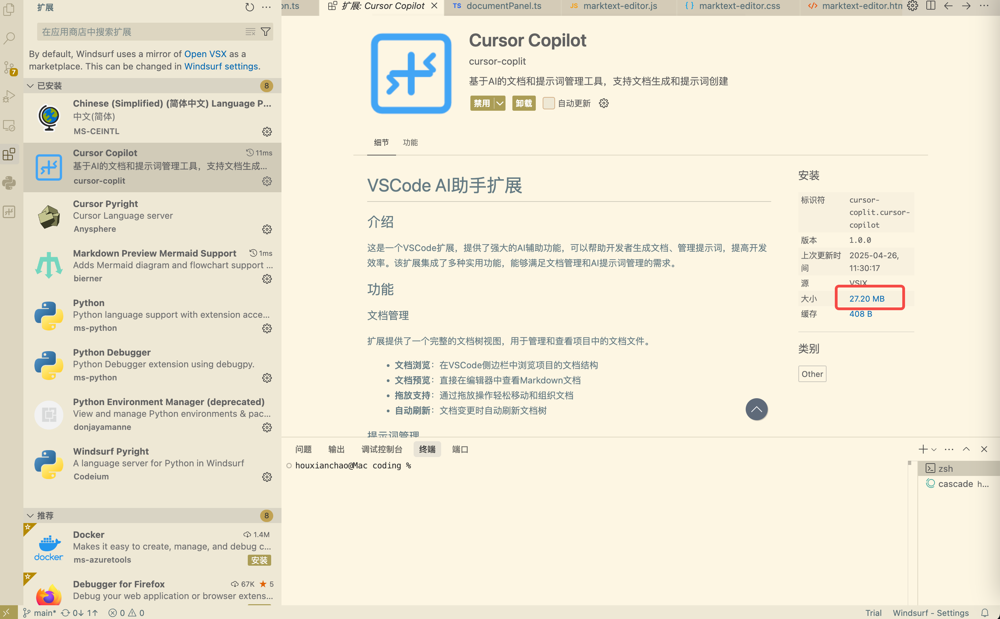

# VSCode AI Assistant Extension

## Introduction

This is a meticulously crafted VSCode extension for developers, offering powerful AI-assisted features that address efficiency pain points in daily development. Whether it's document management, prompt reuse, or code snippet collection, this extension can help you complete your work more efficiently. It integrates multiple practical functions and is particularly suitable for teams and individuals using AI for development.

## Core Features

### 📌 Favorites (Pins)

Do you often need to repeatedly find the same file or code snippet during development? With the Favorites feature, this problem will no longer exist!

- **Quick access to frequently used files**: Bookmark important files with one click, no more searching through the file tree repeatedly
- **Code snippet saving**: Select code → right-click → Add to Pins, essential code snippets are readily available
- **Precise positioning**: Click on a bookmarked code snippet to jump directly to the exact position, saving search time
- **Drag and drop support**: Organize your favorites through simple drag and drop operations, keeping your workspace tidy
- **Cross-project access**: No matter which project you switch to, your important code and files are always at your fingertips

This feature can save a lot of time switching between files when developing large projects, allowing you to focus on coding rather than finding files.

### 📝 Prompt Management

In AI-assisted development, prompts are a key factor affecting development efficiency, but repeatedly writing high-quality prompts is both time-consuming and cumbersome.

- **Prompt library**: Create, save, and organize prompts, saying goodbye to rewriting the same prompts repeatedly
- **One-click copy**: Click to copy prompt content, seamlessly paste into any AI tool
- **Category management**: Organize different types of prompts through folders, easily find what you need
- **Intelligent generation**: Through integrated MCP services, let AI automatically generate quality prompts based on your needs
- **Multi-language support**: Support for prompt creation and management in various languages

This feature is particularly suitable for developers who need to frequently interact with AI tools and can significantly improve the consistency and efficiency of AI collaboration.

### 📚 Document Management

Project documentation is often scattered, making it difficult to manage and view them in a unified way? The document management function provides you with a centralized solution.

- **Document tree view**: Intuitively browse all project documents in the VSCode sidebar
- **Instant preview**: View Markdown documents directly in the editor without switching applications
- **AI document generation**: Through MCP services, automatically generate complete documents based on brief descriptions
- **Multiple template support**: Requirements documents, function lists, development architecture, and other professional templates are available at any time
- **Real-time synchronization**: Automatically refresh the view when documents change, always keeping up to date

This feature is especially suitable for agile development teams, enabling quick generation and management of various documents, reducing document writing time, and improving team collaboration efficiency.

### 🔍 Project Browsing

Finding files and directories in complex projects can be a headache, especially after the project scale grows.

- **Tree view**: Intuitively display project structure, more focused than the native file browser
- **File operations**: Create, rename, delete files and folders directly in the sidebar
- **Terminal integration**: Right-click to open a terminal in the selected directory
- **Quick path copying**: Copy the absolute or relative path of a file with one click
- **Integration with favorites**: Easily add files to favorites

### 🧩 Code Outline

Quickly understanding the structure is crucial when reading large files.

- **Code structure visualization**: Clearly display classes, functions, and methods in the file
- **Quick navigation**: Click to jump to the corresponding code location
- **Smart grouping**: Organize code elements by type, improving readability
- **Real-time updates**: Automatically update the outline view when editing files

## MCP Service Capabilities

This extension integrates powerful MCP (Managed Command Prompt) services, providing additional capabilities for AI-assisted development.

### Document Generation Service (doc-gen)

Tired of the repetitive labor of writing various standard documents? Let AI handle it for you!

- **Multiple document templates**: Support professional document templates such as requirement documents, function lists, development architecture, etc.
- **Intelligent generation**: Just provide a brief description, and AI can generate complete, structured documents
- **Customized content**: Automatically adjust document content and format according to project characteristics
- **Multi-language support**: Support for generating documents in Chinese, English, and other languages

### Prompt Generation Service (prompt-gen)

Building efficient prompts is an art, and now there's AI to assist you!

- **Intelligent generation**: Automatically generate optimized prompts based on purpose and rules
- **Rule support**: Set global rules and constraints to ensure generated results meet expectations
- **Multi-language support**: Support for generating prompts in various languages
- **Direct saving**: Generated prompts can be automatically saved to the prompt library

## Configuration Method

### Find Plugin Installation Location

To correctly configure MCP services, you first need to find where the plugin is installed:

1. Find the installed plugin in the VS Code extensions page
2. Click on the plugin, then click on the size (blue) in the plugin page


3. This will open the plugin installation directory, copy this path for the configuration below

## Installing Dependencies

The MCP services of this plugin require Python dependencies. To simplify the configuration process, we recommend creating a shared virtual environment for all MCP services.

### Creating a Shared Python Virtual Environment

The following steps will guide you on how to create a shared virtual environment that can be used for all MCP services:

#### 1. Install Necessary Tools

If you haven't installed Python or pip yet, install them first:

```bash
# For macOS users (using Homebrew)
brew install python

# Confirm installation
python3 --version
pip3 --version
```

#### 2. Create a Shared Virtual Environment

```bash
# Navigate to the plugin installation directory
cd plugin_installation_path

# Create a shared virtual environment
python3 -m venv mcp_env

# Activate the virtual environment
source mcp_env/bin/activate  # On Windows use: mcp_env\Scripts\activate

# Install all necessary dependencies
pip install -r requirements.txt

# This file contains all dependencies needed by both MCP services

# Exit the virtual environment after installation is complete
deactivate
```

#### 3. Update Configuration File

After completing the above steps, configure the mcp_config.json configuration file:

```json
{
  "mcpServers": {
    "doc-gen": {
      "command": "/plugin_installation_path/mcp_env/bin/python",
      "args": [
        "/plugin_installation_path/doc-gen-server/server.py"
      ],
      "env": {
        "API_KEY": "your-api-key",
        "MODEL": "model-name",
        "API_URL": "https://api.example.com/v1"
      },
      "cwd": "/plugin_installation_path/doc-gen-server"
    },
    "prompt-gen": {
      "command": "/plugin_installation_path/mcp_env/bin/python",
      "args": [
        "/plugin_installation_path/prompt_gen_server/server.py"
      ],
      "env": {
        "API_KEY": "your-api-key",
        "MODEL": "model-name",
        "API_URL": "https://api.example.com/v1"
      },
      "cwd": "/plugin_installation_path/prompt_gen_server"
    }
  }
}
```

---

# VSCode AI助手扩展

## 介绍

这是一个为开发者精心打造的VSCode扩展，提供了强大的AI辅助功能，解决日常开发中的效率痛点。无论是文档管理、提示词复用还是代码片段收藏，都能帮助您更高效地完成工作。该扩展集成了多种实用功能，特别适合使用AI进行开发的团队和个人。

## 核心功能

### 📌 收藏夹 (Pins)

在开发过程中是否经常需要反复查找同一个文件或代码片段？有了收藏夹功能，这个问题将不复存在！

- **快速访问常用文件**：一键收藏重要文件，不再在文件树中反复寻找
- **代码片段保存**：选中代码→右键→Add to Pins，关键代码片段随手可得
- **跳转精确定位**：点击收藏的代码片段直接跳转到准确位置，省去搜索时间
- **拖放支持**：通过简单拖放操作整理您的收藏夹，保持工作空间整洁
- **跨项目访问**：无论切换到哪个项目，您的重要代码和文件始终触手可及

开发大型项目时，这个功能可以节省大量在文件间切换的时间，让您专注于编码而非查找文件。

### 📝 提示词管理

AI辅助开发过程中，提示词是影响开发效率的关键因素，但重复编写高质量提示词既耗时又繁琐。

- **提示词库**：创建、保存和组织提示词，彻底告别反复编写同样提示词的烦恼
- **一键复制**：单击即可复制提示词内容，无缝粘贴到任何AI工具中
- **分类管理**：通过文件夹组织不同类型的提示词，轻松找到所需内容
- **智能生成**：通过集成的MCP服务，让AI根据您的需求自动生成优质提示词
- **多语言支持**：支持各种语言的提示词创建和管理

这一功能尤其适合需要频繁与AI工具交互的开发者，可以显著提高AI协作的一致性和效率。

### 📚 文档管理

项目文档常常分散各处，难以统一管理和查看？文档管理功能为您提供了集中式的解决方案。

- **文档树视图**：在VSCode侧边栏中直观浏览所有项目文档
- **即时预览**：直接在编辑器中查看Markdown文档，无需切换应用
- **AI文档生成**：通过MCP服务，根据简短描述自动生成完整文档
- **多种模板支持**：需求文档、功能列表、开发架构等多种专业模板随时可用
- **实时同步**：文档变更时自动刷新视图，始终保持最新状态

这一功能特别适合敏捷开发团队，能够快速生成和管理各类文档，减少文档编写时间，提高团队协作效率。

### 🔍 项目浏览

在复杂项目中查找文件和目录常常让人头疼，尤其是项目规模增长后。

- **树形视图**：直观展示项目结构，比原生文件浏览器更专注
- **文件操作**：直接在侧边栏创建、重命名、删除文件和文件夹
- **终端集成**：右键点击即可在所选目录中打开终端
- **快速复制路径**：一键复制文件的绝对或相对路径
- **与收藏夹联动**：轻松将文件添加到收藏夹中

### 🧩 代码大纲

阅读大型文件时，快速了解其结构至关重要。

- **代码结构可视化**：清晰展示文件中的类、函数和方法
- **快速导航**：点击即可跳转到相应代码位置
- **智能分组**：按类型组织代码元素，提高可读性
- **实时更新**：编辑文件时自动更新大纲视图

## MCP服务能力

本扩展集成了强大的MCP（Managed Command Prompt）服务，为AI辅助开发提供了额外能力。

### 文档生成服务 (doc-gen)

厌倦了编写各种标准文档的重复劳动？让AI为您处理！

- **多种文档模板**：支持需求文档、功能列表、开发架构等多种专业文档模板
- **智能生成**：只需提供简短描述，AI即可生成完整、结构化的文档
- **定制化内容**：根据项目特点自动调整文档内容和格式
- **多语言支持**：支持生成中文、英文等多语言文档


### 提示词生成服务 (prompt-gen)

构建高效提示词是一门艺术，现在有AI来协助您了！

- **智能生成**：根据目的和规则自动生成优化的提示词
- **规则支持**：可设置全局规则和约束，确保生成结果符合预期
- **多语言支持**：支持生成各种语言的提示词
- **直接保存**：生成的提示词可自动保存到提示词库中


## 配置方法

### 查找插件安装位置

要正确配置MCP服务，您首先需要找到插件的安装位置：

1. 在VS Code拓展页面中找到已安装的插件
2. 点击插件，在插件页面点击大小（蓝色）


3. 这将打开插件的安装目录，复制此路径用于下面的配置


## 安装依赖

本插件的MCP服务需要安装Python依赖。为了简化配置过程，我们推荐为所有MCP服务创建一个共享的虚拟环境。

### 创建共享Python虚拟环境

以下步骤将指导您如何创建一个共享虚拟环境，可用于所有MCP服务：

#### 1. 安装必要工具

如果您尚未安装Python或pip，请先安装它们：

```bash
# 对于macOS用户（使用Homebrew）
brew install python

# 确认安装
python3 --version
pip3 --version
```

#### 2. 创建共享虚拟环境

```bash
# 导航到插件安装目录
cd 插件安装路径

# 创建共享虚拟环境
python3 -m venv mcp_env

# 激活虚拟环境
source mcp_env/bin/activate  # 在Windows上使用: mcp_env\Scripts\activate

# 安装所有必要的依赖
pip install -r requirements.txt

# 该文件包含了两个MCP服务所需的所有依赖

# 安装完成后退出虚拟环境
deactivate
```

#### 3. 更新配置文件

完成上述步骤后，配置mcp_config.json配置文件：

```json
{
  "mcpServers": {
    "doc-gen": {
      "command": "/插件安装路径/mcp_env/bin/python",
      "args": [
        "/插件安装路径/doc-gen-server/server.py"
      ],
      "env": {
        "API_KEY": "your-api-key",
        "MODEL": "model-name",
        "API_URL": "https://api.example.com/v1"
      },
      "cwd": "/插件安装路径/doc-gen-server"
    },
    "prompt-gen": {
      "command": "/插件安装路径/mcp_env/bin/python",
      "args": [
        "/插件安装路径/prompt_gen_server/server.py"
      ],
      "env": {
        "API_KEY": "your-api-key",
        "MODEL": "model-name",
        "API_URL": "https://api.example.com/v1"
      },
      "cwd": "/插件安装路径/prompt_gen_server"
    }
  }
}
```


