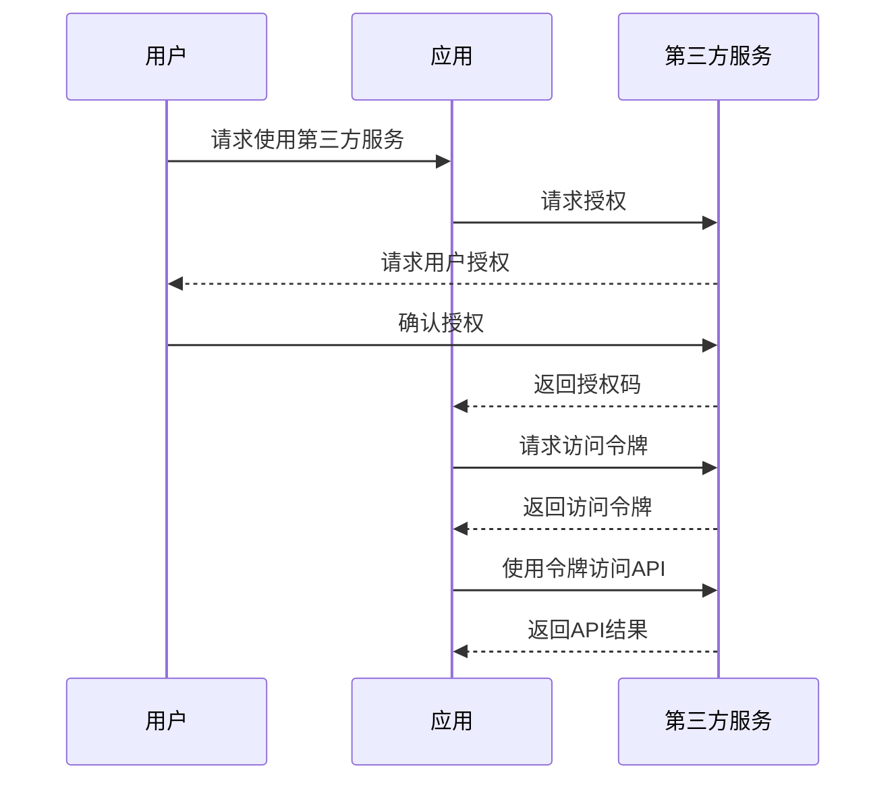

# API依赖文档

## 1. API依赖概述

### 1.1 外部API依赖说明
<!-- 描述项目依赖的外部API服务总体情况 -->

### 1.2 依赖管理策略
<!-- 描述如何管理这些API依赖 -->

## 2. 第三方API服务列表

<!-- 详细列出项目所依赖的所有第三方API服务 -->

### 2.1 认证/授权服务

| API名称 | 提供商 | 用途 | 接入方式 | 文档链接 |
|---------|--------|------|---------|----------|
|  |  |  | OAuth/API Key/其他 |  |

### 2.2 支付服务

| API名称 | 提供商 | 用途 | 接入方式 | 文档链接 |
|---------|--------|------|---------|----------|
|  |  |  | OAuth/API Key/其他 |  |

### 2.3 存储服务

| API名称 | 提供商 | 用途 | 接入方式 | 文档链接 |
|---------|--------|------|---------|----------|
|  |  |  | OAuth/API Key/其他 |  |

### 2.4 通信服务

| API名称 | 提供商 | 用途 | 接入方式 | 文档链接 |
|---------|--------|------|---------|----------|
|  |  |  | OAuth/API Key/其他 |  |

### 2.5 其他服务

| API名称 | 提供商 | 用途 | 接入方式 | 文档链接 |
|---------|--------|------|---------|----------|
|  |  |  | OAuth/API Key/其他 |  |

## 3. API调用详情

<!-- 详细描述重要API的调用方法和示例 -->

### 3.1 认证/授权流程

<!-- 描述认证流程 -->



### 3.2 关键API调用示例

#### API名称：XXX

**请求方式：** GET/POST/PUT/DELETE

**请求URL：** `https://api.example.com/endpoint`

**请求头：**

```json
{
  "Authorization": "Bearer ACCESS_TOKEN",
  "Content-Type": "application/json"
}
```

**请求参数：**

```json
{
  "param1": "value1",
  "param2": "value2"
}
```

**返回数据：**

```json
{
  "status": "success",
  "data": {
    "key1": "value1",
    "key2": "value2"
  }
}
```

#### API名称：YYY

<!-- 继续添加更多API调用示例 -->

## 4. 错误处理

### 4.1 错误码处理
<!-- 描述外部API错误码处理策略 -->

### 4.2 失败重试机制
<!-- 描述API调用失败时的重试机制 -->

### 4.3 服务降级策略
<!-- 描述当API服务不可用时的降级策略 -->

## 5. 数据安全与隐私

<!-- 描述外部API数据安全和隐私保护措施 -->

## 6. 监控与告警

<!-- 描述对外部API的监控和告警机制 -->

## 7. API依赖风险评估

| API名称 | 风险程度 | 潜在风险 | 应对措施 |
|---------|---------|----------|---------|
|  | 高/中/低 |  |  |
|  | 高/中/低 |  |  |

## 8. 版本兼容性

<!-- 描述API版本更新的兼容性策略 -->

---

## 变更记录

| 版本 | 日期 | 作者 | 变更内容 |
|------|------|------|---------|
| v1.0 | YYYY-MM-DD | [作者名] | 初始版本 |
