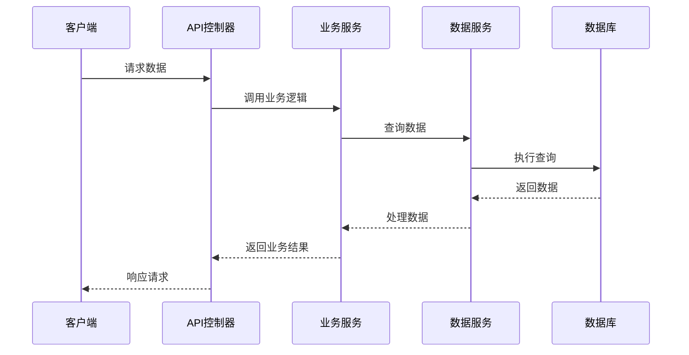

# 后端功能文档

## 1. 后端架构概述

### 1.1 架构设计
<!-- 描述后端架构设计和分层结构 -->

### 1.2 技术栈
<!-- 详细说明使用的技术栈、框架和库 -->

| 技术/框架 | 版本 | 用途 |
|----------|------|------|
|  |  |  |
|  |  |  |

## 2. 核心工具和功能

### 2.1 工具函数
<!-- 列出核心工具函数及其功能 -->

| 函数名称 | 功能描述 | 参数 | 返回值 |
|---------|---------|------|--------|
|  |  |  |  |
|  |  |  |  |

### 2.2 辅助工具
<!-- 描述辅助工具和功能 -->

## 3. 业务逻辑实现

### 3.1 服务模块
<!-- 描述核心服务模块 -->

| 服务名称 | 功能职责 | 依赖服务 |
|---------|---------|---------|
|  |  |  |
|  |  |  |

### 3.2 业务流程
<!-- 描述主要业务流程的实现 -->

## 4. 数据处理

### 4.1 数据访问层
<!-- 描述数据访问层的实现 -->

### 4.2 数据转换
<!-- 描述数据转换和映射逻辑 -->

### 4.3 数据验证
<!-- 描述数据验证和处理机制 -->

## 5. 功能实现详情

### 5.1 用户认证与授权
<!-- 描述用户认证和授权机制 -->

### 5.2 业务核心功能
<!-- 详细描述核心业务功能的实现 -->

### 5.3 定时任务
<!-- 描述定时任务和计划任务的实现 -->

### 5.4 异步处理
<!-- 描述异步处理机制 -->

## 6. 错误处理

### 6.1 异常处理机制
<!-- 描述异常处理机制 -->

### 6.2 错误码设计
<!-- 描述错误码的设计和使用 -->

| 错误码 | 描述 | 处理方式 |
|--------|------|---------|
|  |  |  |
|  |  |  |

## 7. 日志与监控

### 7.1 日志系统
<!-- 描述日志系统的实现 -->

### 7.2 监控机制
<!-- 描述系统监控机制 -->

## 8. 优化策略

### 8.1 性能优化
<!-- 描述性能优化策略 -->

### 8.2 代码复用
<!-- 描述代码复用和模块化策略 -->

## 9. 测试策略

<!-- 描述后端测试策略 -->

## 10. 部署与维护

<!-- 描述后端部署和维护方案 -->

---

## 变更记录

| 版本 | 日期 | 作者 | 变更内容 |
|------|------|------|---------|
| v1.0 | YYYY-MM-DD | [作者名] | 初始版本 |
