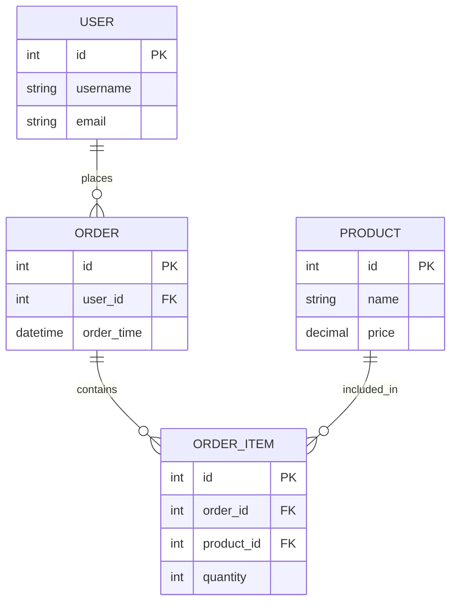

# 数据库设计文档

## 1. 数据库概述

### 1.1 数据库选型
<!-- 描述数据库选型及理由 -->

### 1.2 设计原则
<!-- 描述数据库设计遵循的原则 -->

## 2. 数据表设计

### 2.1 表概览
<!-- 列出所有数据表及其用途 -->

| 表名 | 说明 | 存储内容 |
|------|------|---------|
|  |  |  |
|  |  |  |

### 2.2 表结构详情

<!-- 针对每个表详细描述其结构 -->

#### 表名：xxx

| 字段名 | 数据类型 | 长度 | 允许空 | 默认值 | 主键 | 说明 |
|--------|---------|------|--------|--------|------|------|
|  |  |  |  |  |  |  |
|  |  |  |  |  |  |  |

索引：
- 主键索引：xxx
- 唯一索引：xxx
- 普通索引：xxx

#### 表名：yyy

| 字段名 | 数据类型 | 长度 | 允许空 | 默认值 | 主键 | 说明 |
|--------|---------|------|--------|--------|------|------|
|  |  |  |  |  |  |  |
|  |  |  |  |  |  |  |

索引：
- 主键索引：yyy
- 唯一索引：yyy
- 普通索引：yyy

## 3. 表关系设计

### 3.1 ER图
<!-- 使用mermaid绘制实体关系图 -->

### 3.2 表关系说明
<!-- 描述表之间的关系 -->

| 关系 | 主表 | 从表 | 关系类型 | 说明 |
|------|------|------|----------|------|
|  |  |  | 一对一/一对多/多对多 |  |
|  |  |  | 一对一/一对多/多对多 |  |

## 4. 索引设计

### 4.1 索引策略
<!-- 描述索引设计策略 -->

### 4.2 索引列表
<!-- 列出所有索引 -->

| 表名 | 索引名 | 索引类型 | 包含字段 | 用途 |
|------|--------|----------|----------|------|
|  |  | 主键/唯一/普通/全文/空间 |  |  |
|  |  | 主键/唯一/普通/全文/空间 |  |  |

## 5. 数据字典

<!-- 提供核心业务字段的数据字典 -->

### 5.1 状态类型
<!-- 描述状态类型常量 -->

| 代码 | 名称 | 说明 |
|------|------|------|
|  |  |  |
|  |  |  |

### 5.2 其他枚举类型
<!-- 描述其他枚举类型常量 -->

## 6. 数据库优化

### 6.1 性能优化策略
<!-- 描述数据库性能优化策略 -->

### 6.2 数据安全策略
<!-- 描述数据安全策略 -->

## 7. 数据迁移与升级

<!-- 描述数据迁移和升级策略 -->

## 8. 备份与恢复

<!-- 描述数据库备份与恢复方案 -->

---

## 变更记录

| 版本 | 日期 | 作者 | 变更内容 |
|------|------|------|---------|
| v1.0 | YYYY-MM-DD | [作者名] | 初始版本 |
