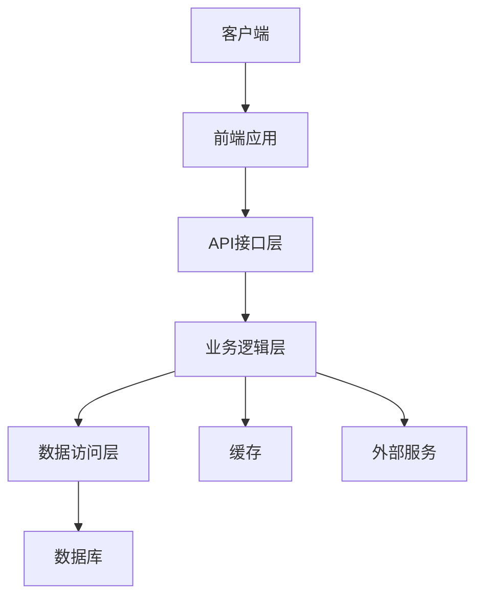

# 开发架构

## 1. 系统架构概述

### 1.1 架构目标
<!-- 描述架构设计的总体目标和原则 -->

### 1.2 系统边界
<!-- 定义系统的范围和边界 -->

### 1.3 技术选型
<!-- 列出主要技术选型及理由 -->

| 技术/框架 | 用途 | 选择理由 | 备选方案 |
|----------|------|---------|----------|
|  |  |  |  |
|  |  |  |  |

## 2. 整体架构

### 2.1 架构图
<!-- 使用Mermaid绘制系统整体架构图 -->

### 2.2 前后端分离
<!-- 描述前后端分离的实现方式 -->

### 2.3 部署架构
<!-- 描述系统的部署结构 -->

## 3. 前端架构

### 3.1 技术栈
<!-- 详细描述前端技术栈 -->

### 3.2 模块组织
<!-- 描述前端代码组织和模块划分 -->

### 3.3 状态管理
<!-- 描述前端状态管理方案 -->

### 3.4 路由设计
<!-- 描述前端路由设计 -->

## 4. 后端架构

### 4.1 技术栈
<!-- 详细描述后端技术栈 -->

### 4.2 分层设计
<!-- 描述后端分层设计（如控制层、服务层、数据访问层等） -->

### 4.3 API设计规范
<!-- 描述API设计规范和原则 -->

### 4.4 中间件使用
<!-- 描述使用的中间件和作用 -->

## 5. 数据库设计

### 5.1 数据库选型
<!-- 描述数据库选型及理由 -->

### 5.2 数据模型
<!-- 概述主要数据模型和表结构 -->

### 5.3 数据库优化策略
<!-- 描述数据库优化策略（如索引、分区等） -->

## 6. 安全架构

<!-- 描述系统安全架构设计 -->

## 7. 环境依赖

### 7.1 开发环境
<!-- 列出开发环境依赖 -->

### 7.2 生产环境
<!-- 列出生产环境依赖 -->

### 7.3 第三方依赖
<!-- 列出第三方服务依赖 -->

## 8. 扩展性与可维护性

<!-- 描述架构的扩展性和可维护性设计 -->

## 9. 架构演进计划

<!-- 描述架构的演进计划和未来发展方向 -->

---

## 变更记录

| 版本 | 日期 | 作者 | 变更内容 |
|------|------|------|---------|
| v1.0 | YYYY-MM-DD | [作者名] | 初始版本 |
