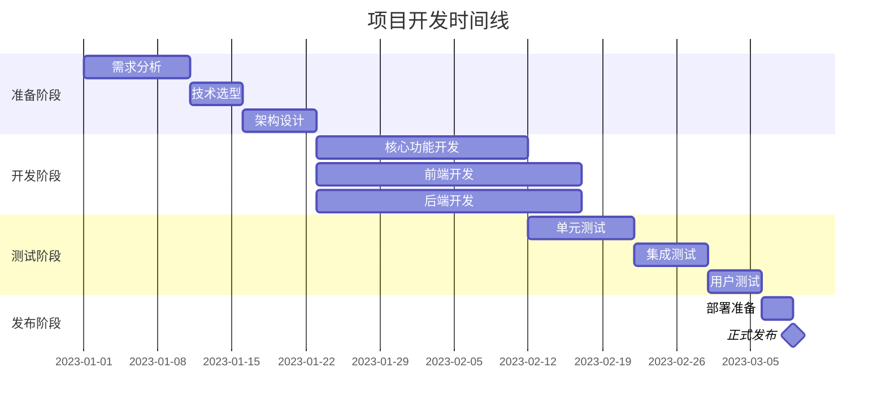

# 开发计划文档

## 1. 项目概述

### 1.1 项目背景
<!-- 简要描述项目背景 -->

### 1.2 项目目标
<!-- 描述项目要达成的目标 -->

### 1.3 项目范围
<!-- 明确项目的范围，包括和不包括的内容 -->

## 2. 开发阶段规划

### 2.1 总体时间线
<!-- 使用甘特图展示总体时间线 -->

## 3. 核心功能开发计划

### 3.1 第一阶段：核心功能
<!-- 描述核心功能的开发计划 -->

| 功能模块 | 起始日期 | 结束日期 | 负责人 | 优先级 | 依赖关系 |
|---------|---------|---------|--------|--------|---------|
|  |  |  |  | 高/中/低 |  |
|  |  |  |  | 高/中/低 |  |

### 3.2 第二阶段：增强功能
<!-- 描述增强功能的开发计划 -->

| 功能模块 | 起始日期 | 结束日期 | 负责人 | 优先级 | 依赖关系 |
|---------|---------|---------|--------|--------|---------|
|  |  |  |  | 高/中/低 |  |
|  |  |  |  | 高/中/低 |  |

### 3.3 第三阶段：优化和扩展
<!-- 描述优化和扩展功能的开发计划 -->

| 功能模块 | 起始日期 | 结束日期 | 负责人 | 优先级 | 依赖关系 |
|---------|---------|---------|--------|--------|---------|
|  |  |  |  | 高/中/低 |  |
|  |  |  |  | 高/中/低 |  |

## 4. 技术开发计划

### 4.1 前端开发计划
<!-- 描述前端的开发计划 -->

| 模块 | 技术栈 | 开发周期 | 负责人 | 优先级 |
|------|--------|---------|--------|--------|
|  |  |  |  | 高/中/低 |
|  |  |  |  | 高/中/低 |

### 4.2 后端开发计划
<!-- 描述后端的开发计划 -->

| 模块 | 技术栈 | 开发周期 | 负责人 | 优先级 |
|------|--------|---------|--------|--------|
|  |  |  |  | 高/中/低 |
|  |  |  |  | 高/中/低 |

### 4.3 数据库开发计划
<!-- 描述数据库开发计划 -->

| 工作项 | 开发周期 | 负责人 | 优先级 |
|--------|---------|--------|--------|
|  |  |  | 高/中/低 |
|  |  |  | 高/中/低 |

### 4.4 接口开发计划
<!-- 描述接口开发计划 -->

| 接口 | 开发周期 | 负责人 | 优先级 |
|------|---------|--------|--------|
|  |  |  | 高/中/低 |
|  |  |  | 高/中/低 |

## 5. 开发资源规划

### 5.1 人力资源
<!-- 描述项目所需的人力资源 -->

| 角色 | 人数 | 工作内容 | 投入时间 |
|------|------|---------|---------|
|  |  |  |  |
|  |  |  |  |

### 5.2 开发环境
<!-- 描述开发环境的准备和配置 -->

### 5.3 依赖资源
<!-- 描述外部依赖资源 -->

## 6. 风险与应对策略

| 风险项 | 可能性 | 影响 | 应对策略 |
|--------|--------|------|---------|
|  | 高/中/低 | 高/中/低 |  |
|  | 高/中/低 | 高/中/低 |  |

## 7. 质量管控

### 7.1 代码质量标准
<!-- 描述代码质量标准 -->

### 7.2 测试计划
<!-- 描述测试计划和策略 -->

### 7.3 验收标准
<!-- 描述项目验收标准 -->

## 8. 上线和维护计划

### 8.1 上线准备
<!-- 描述上线前的准备工作 -->

### 8.2 运维计划
<!-- 描述上线后的运维计划 -->

### 8.3 迭代计划
<!-- 描述后续迭代计划 -->

---

## 变更记录

| 版本 | 日期 | 作者 | 变更内容 |
|------|------|------|---------|
| v1.0 | YYYY-MM-DD | [作者名] | 初始版本 |
