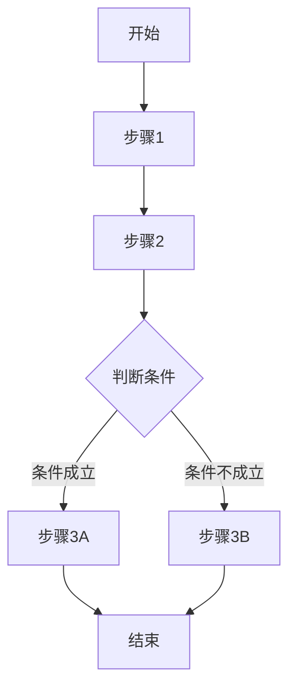

# 功能文档

## 1. 功能概述

### 1.1 功能名称
<!-- 功能的名称 -->

### 1.2 功能描述
<!-- 简要描述该功能的作用和价值 -->

### 1.3 所属模块
<!-- 该功能所属的模块或功能组 -->

### 1.4 功能优先级
<!-- 该功能的优先级（高/中/低） -->

## 2. 功能需求

### 2.1 功能背景
<!-- 开发该功能的背景和目的 -->

### 2.2 用户场景
<!-- 用户使用该功能的典型场景描述 -->

### 2.3 功能流程
<!-- 使用流程图描述功能的实现流程 -->



### 2.4 业务规则
<!-- 描述与该功能相关的业务规则 -->

| 规则ID | 规则描述 | 处理逻辑 |
|--------|---------|---------|
| R001 |  |  |
| R002 |  |  |

## 3. 功能设计

### 3.1 界面设计
<!-- 如适用，描述功能的UI设计 -->

### 3.2 接口设计
<!-- 描述功能涉及的接口设计 -->

#### 3.2.1 前端接口

| 接口名称 | 用途 | 参数 | 返回值 |
|---------|------|------|--------|
|  |  |  |  |
|  |  |  |  |

#### 3.2.2 后端接口

| 接口路径 | 请求方式 | 描述 | 请求参数 | 返回数据 |
|---------|---------|------|---------|---------|
|  | GET/POST/PUT/DELETE |  |  |  |
|  | GET/POST/PUT/DELETE |  |  |  |

### 3.3 数据设计
<!-- 描述功能涉及的数据结构设计 -->

#### 3.3.1 数据模型

| 字段名 | 类型 | 描述 | 约束 |
|--------|------|------|------|
|  |  |  |  |
|  |  |  |  |

#### 3.3.2 状态定义

| 状态码 | 状态名称 | 状态描述 |
|--------|---------|---------|
|  |  |  |
|  |  |  |

## 4. 实现方案

### 4.1 技术方案
<!-- 描述功能的实现技术方案 -->

### 4.2 代码结构
<!-- 描述功能的代码组织结构 -->

```
src/
├── components/
│   ├── FeatureComponent.js
│   └── SubComponent.js
├── services/
│   └── featureService.js
└── utils/
    └── featureUtils.js
```

### 4.3 算法或关键逻辑
<!-- 描述功能中的关键算法或逻辑 -->

### 4.4 依赖关系
<!-- 描述该功能与其他功能或模块的依赖关系 -->

| 依赖项 | 依赖类型 | 依赖说明 |
|--------|---------|---------|
|  | 强依赖/弱依赖 |  |
|  | 强依赖/弱依赖 |  |

## 5. 测试方案

### 5.1 测试用例
<!-- 描述功能的关键测试用例 -->

| 测试ID | 测试场景 | 测试步骤 | 预期结果 |
|--------|---------|---------|---------|
| T001 |  |  |  |
| T002 |  |  |  |

### 5.2 边界条件
<!-- 描述功能的边界条件和异常情况处理 -->

| 边界条件 | 处理方式 | 预期结果 |
|---------|---------|---------|
|  |  |  |
|  |  |  |

## 6. 上线和维护

### 6.1 上线检查项
<!-- 上线前需要检查的项目 -->

| 检查项 | 检查内容 | 完成状态 |
|--------|---------|---------|
|  |  | 未开始/进行中/已完成 |
|  |  | 未开始/进行中/已完成 |

### 6.2 监控指标
<!-- 上线后需要监控的指标 -->

| 指标名称 | 监控方式 | 告警阈值 |
|---------|---------|---------|
|  |  |  |
|  |  |  |

## 7. 风险评估

| 风险点 | 可能性 | 影响 | 缓解措施 |
|--------|--------|------|---------|
|  | 高/中/低 | 高/中/低 |  |
|  | 高/中/低 | 高/中/低 |  |

## 8. 遗留问题
<!-- 记录当前遗留的问题和计划 -->

| 问题ID | 问题描述 | 解决计划 | 负责人 |
|--------|---------|---------|--------|
| P001 |  |  |  |
| P002 |  |  |  |

---

## 变更记录

| 版本 | 日期 | 作者 | 变更内容 |
|------|------|------|---------|
| v1.0 | YYYY-MM-DD | [作者名] | 初始版本 |
