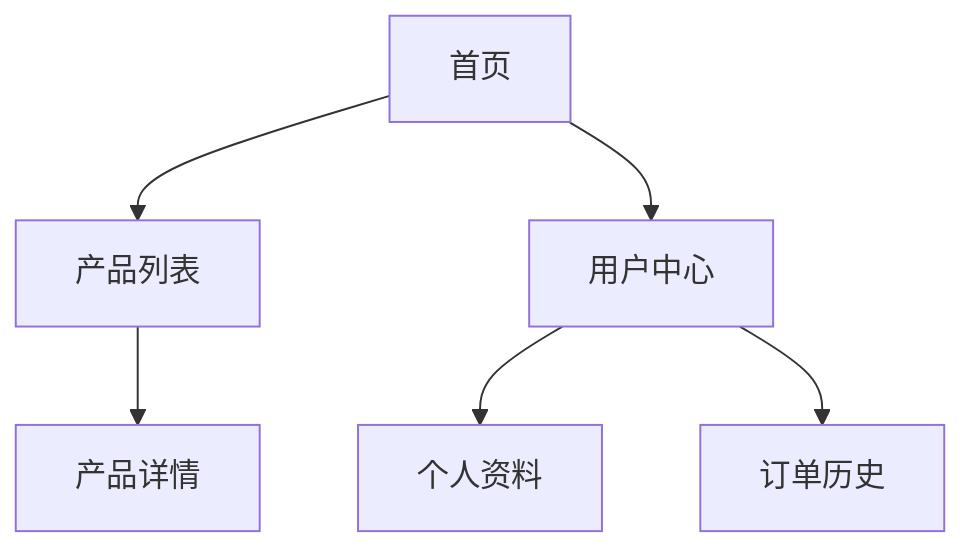

# 前端功能文档

## 1. 界面设计

### 1.1 设计风格
<!-- 描述整体UI设计风格、主题和视觉规范 -->

### 1.2 色彩方案
<!-- 定义使用的主要色彩方案、色值和用途 -->

| 颜色 | 色值 | 用途 |
|------|------|------|
| 主色 | #XXXXXX | 主要按钮、重点强调 |
| 辅助色 | #XXXXXX | 次要信息、辅助功能 |
| 背景色 | #XXXXXX | 页面背景 |
| 文字色 | #XXXXXX | 主要文字内容 |

### 1.3 字体规范
<!-- 定义使用的字体、大小和用途 -->

| 字体类型 | 大小 | 粗细 | 用途 |
|---------|------|------|------|
| 标题字体 |  |  | 页面标题、主要标题 |
| 正文字体 |  |  | 正文内容 |
| 备注字体 |  |  | 附加说明、备注信息 |

### 1.4 响应式设计
<!-- 描述响应式设计方案和断点设置 -->

## 2. 组件库

### 2.1 核心组件
<!-- 列出使用的核心组件及其功能 -->

| 组件名称 | 功能描述 | 用途 |
|---------|---------|------|
|  |  |  |
|  |  |  |

### 2.2 自定义组件
<!-- 描述需要自定义开发的组件 -->

| 组件名称 | 功能描述 | 技术实现 |
|---------|---------|---------|
|  |  |  |
|  |  |  |

### 2.3 组件交互
<!-- 描述组件间的交互方式 -->

## 3. 页面结构

### 3.1 页面布局
<!-- 描述页面的总体布局结构 -->

### 3.2 页面导航
<!-- 描述导航结构和页面间的跳转关系 -->

### 3.3 页面列表
<!-- 列出所有页面及其功能描述 -->

| 页面名称 | 路由 | 功能描述 | 访问权限 |
|---------|------|---------|----------|
|  |  |  |  |
|  |  |  |  |

## 4. 交互设计

### 4.1 操作流程
<!-- 描述主要用户操作流程 -->

### 4.2 交互反馈
<!-- 描述系统反馈机制（加载状态、成功/错误提示等） -->

### 4.3 动画效果
<!-- 描述使用的动画效果及其目的 -->

## 5. 状态管理

### 5.1 状态结构
<!-- 描述前端状态管理的结构设计 -->

### 5.2 状态流转
<!-- 描述状态变化的流程和触发条件 -->

## 6. API调用

### 6.1 API集成
<!-- 描述前端如何集成和调用后端API -->

### 6.2 数据处理
<!-- 描述前端数据处理逻辑 -->

## 7. 性能优化

<!-- 描述前端性能优化策略 -->

## 8. 兼容性

<!-- 描述浏览器/设备兼容性要求和处理方案 -->

## 9. 依赖资源

### 9.1 第三方库
<!-- 列出使用的第三方库及其用途 -->

| 库名称 | 版本 | 用途 |
|--------|------|------|
|  |  |  |
|  |  |  |

### 9.2 资源文件
<!-- 描述使用的资源文件（图片、字体等） -->

---

## 变更记录

| 版本 | 日期 | 作者 | 变更内容 |
|------|------|------|---------|
| v1.0 | YYYY-MM-DD | [作者名] | 初始版本 |
