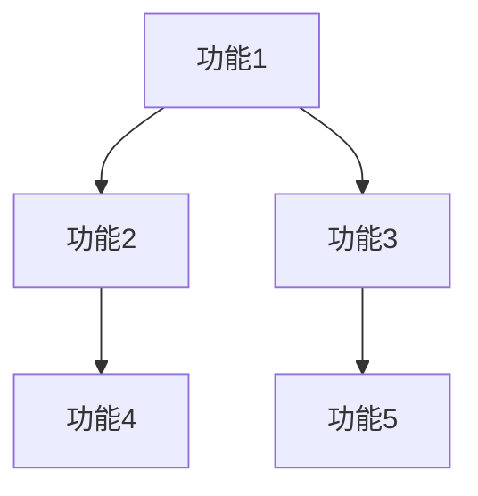

# 功能列表

## 1. 功能概览

<!-- 简述系统的整体功能集合和目标 -->

## 2. 功能分类

<!-- 将功能按照类别或模块进行分组 -->

## 3. 详细功能列表

| 功能ID | 功能名称 | 功能描述 | 优先级 | 所属模块 | 负责人 | 状态 |
|--------|---------|----------|--------|----------|--------|------|
| F001 |  |  | 高/中/低 |  |  | 规划中/开发中/已完成 |
| F002 |  |  | 高/中/低 |  |  | 规划中/开发中/已完成 |
| F003 |  |  | 高/中/低 |  |  | 规划中/开发中/已完成 |
| F004 |  |  | 高/中/低 |  |  | 规划中/开发中/已完成 |
| F005 |  |  | 高/中/低 |  |  | 规划中/开发中/已完成 |

## 4. 功能依赖关系

<!-- 描述功能之间的依赖关系，可以使用表格或图表 -->

## 5. 功能实现优先级

### 5.1 第一阶段（核心功能）

<!-- 列出第一阶段需要实现的核心功能 -->

### 5.2 第二阶段（重要功能）

<!-- 列出第二阶段需要实现的重要功能 -->

### 5.3 第三阶段（增强功能）

<!-- 列出第三阶段需要实现的增强功能 -->

## 6. 功能验收标准

<!-- 描述功能完成的标准和验收方式 -->

## 7. 版本规划

<!-- 描述不同版本中计划实现的功能集合 -->

---

## 变更记录

| 版本 | 日期 | 作者 | 变更内容 |
|------|------|------|---------|
| v1.0 | YYYY-MM-DD | [作者名] | 初始版本 |
