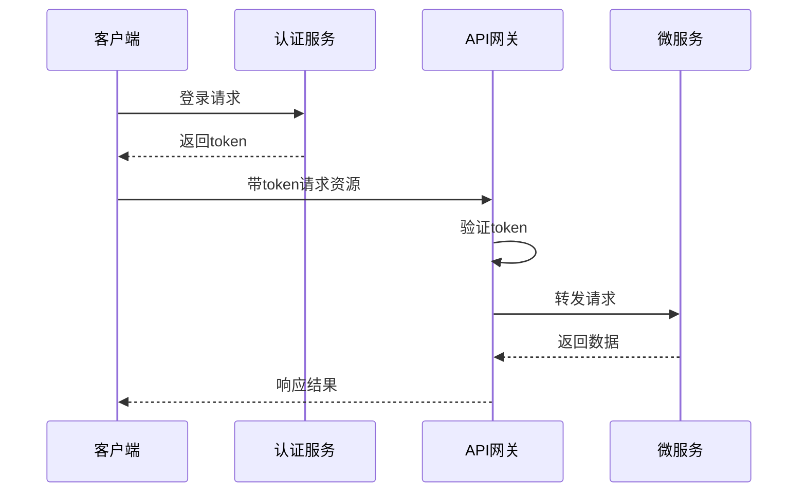

# 服务端接口文档

## 1. 接口概述

### 1.1 接口设计原则
<!-- 描述API设计原则和规范 -->

### 1.2 认证与授权
<!-- 描述API认证和授权机制 -->

### 1.3 通用返回格式
<!-- 描述API通用的返回数据格式 -->

```json
{
  "code": 200,
  "message": "操作成功",
  "data": {
    // 业务数据
  }
}
```

## 2. 接口列表

<!-- 按模块分组列出所有接口 -->

### 2.1 用户模块

#### 2.1.1 用户注册

- **接口路径**：`/api/user/register`
- **请求方式**：POST
- **接口描述**：用户注册接口

**请求参数：**

| 参数名 | 必选 | 类型 | 说明 |
|--------|------|------|------|
| username | 是 | string | 用户名 |
| password | 是 | string | 密码 |
| email | 是 | string | 邮箱 |

**请求示例：**

```json
{
  "username": "example",
  "password": "password123",
  "email": "example@example.com"
}
```

**返回参数：**

| 参数名 | 类型 | 说明 |
|--------|------|------|
| userId | integer | 用户ID |
| token | string | 认证令牌 |

**返回示例：**

```json
{
  "code": 200,
  "message": "注册成功",
  "data": {
    "userId": 12345,
    "token": "eyJhbGciOiJIUzI1NiIsInR5cCI6IkpXVCJ9..."
  }
}
```

**错误码：**

| 错误码 | 描述 | 说明 |
|--------|------|------|
| 400 | 参数错误 | 请求参数不符合要求 |
| 409 | 用户已存在 | 用户名或邮箱已被注册 |

#### 2.1.2 用户登录

<!-- 按照上面格式继续添加更多接口 -->

### 2.2 产品模块

<!-- 按照上面格式继续添加更多接口 -->

## 3. 状态码说明

| 状态码 | 描述 | 说明 |
|--------|------|------|
| 200 | 成功 | 请求成功处理 |
| 400 | 请求错误 | 请求参数有误 |
| 401 | 未授权 | 未提供认证信息或认证失败 |
| 403 | 禁止访问 | 无权限访问该资源 |
| 404 | 资源不存在 | 请求的资源不存在 |
| 500 | 服务器错误 | 服务器内部错误 |

## 4. 接口调用流程

<!-- 描述典型的接口调用流程 -->



## 5. 接口安全策略

<!-- 描述API安全策略 -->

### 5.1 接口加密
<!-- 描述接口加密方式 -->

### 5.2 限流策略
<!-- 描述接口限流策略 -->

### 5.3 防刷策略
<!-- 描述防刷策略 -->

## 6. 版本控制

<!-- 描述API版本控制策略 -->

## 7. 接口测试

<!-- 描述接口测试方法和工具 -->

---

## 变更记录

| 版本 | 日期 | 作者 | 变更内容 |
|------|------|------|---------|
| v1.0 | YYYY-MM-DD | [作者名] | 初始版本 |
